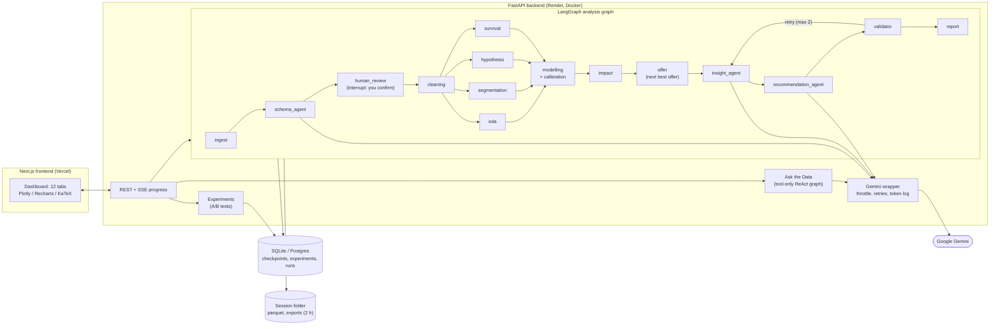

# ChurnLens

[](https://github.com/divu8756/ChurnLens/actions/workflows/ci.yml)

Upload a customer file (CSV or Excel) and ChurnLens runs a full churn analysis with a team
of agents: it proposes the schema for you to confirm, cleans the data, explores it, tests
hypotheses, trains and calibrates a churn model, estimates the money at stake, picks the
next best retention offer per customer, and writes insights and recommendations. It also
designs and analyses A/B tests of those offers, answers questions about the data, and
exports an Excel workbook and a PDF report. Python computes every number; the LLM only
explains numbers that already exist, and a validator checks each one.

**Live demo:** _added after deployment_ · Try it with the built-in sample data.

## Architecture



## How the agents stay honest

- **Digests, not data.** The LLM never sees raw rows: only column names, types, five
  sample values and computed results (JSON). Chat tools return aggregates.
- **Numbers carry a `source_key`.** Every figure an agent writes names the path of the
  computed value it quotes (for example `impact_estimates.overall.churn_rate`).
- **A validator checks every number.** It resolves each `source_key`, compares the value
  and its display text, and rejects any number in the text that was not declared. Failing
  items go back to the agent with feedback (at most twice) and are dropped after that.
- **Structured output only.** Every LLM call returns a Pydantic model through one wrapper
  that throttles, retries and falls back to templates when the model is unavailable.
- **Humans decide.** You confirm the schema before analysis; experiment approvals and ship
  decisions are human gates in an append-only audit log.
- **Assumptions are labelled.** Money figures list their assumptions and whether each
  came from a default, your edit, or the data.

## Tech stack

| Part | Choice | Why |
| --- | --- | --- |
| API | FastAPI, Pydantic | Typed contract that also generates the frontend's types |
| Agents | LangGraph | Parallel branches, human-in-the-loop interrupts, checkpoints |
| LLM | Gemini via `langchain-google-genai` | Generous free tier; one wrapper owns model choice |
| Statistics | pandas, SciPy, statsmodels, lifelines | Tested against the reference libraries to 1e-9 |
| Model | scikit-learn, SHAP | Logistic regression vs gradient boosting, calibrated, explained |
| Experiments | SQLAlchemy + Alembic | Experiments outlive sessions; SQLite locally, Postgres in production |
| Exports | openpyxl, reportlab, matplotlib | Power BI-ready workbook; PDF without system libraries |
| Frontend | Next.js, TypeScript, Tailwind | App Router, strict types |
| Charts | Recharts, Plotly (basic bundle), KaTeX | Plotly loads only when a chart mounts |
| Deploy | Render (Docker), Vercel | Free tiers; one backend process for SSE |

## Run locally

Requirements: Python 3.14, Node 20+, a Gemini API key ([Google AI Studio](https://aistudio.google.com/)).

```bash
cd backend
python3.14 -m venv .venv && .venv/bin/pip install -e ".[dev]"
cp .env.example .env          # set GEMINI_API_KEY, GEMINI_MODEL, GEMINI_MODEL_FAST
.venv/bin/uvicorn app.main:app --port 8010
```

```bash
cd frontend
npm install
NEXT_PUBLIC_API_URL=http://localhost:8010 npm run dev
```

Open <http://localhost:3000> and press **Try sample data**.

## Environment variables

Backend (`backend/.env`, or the host's settings):

| Variable | Default | Meaning |
| --- | --- | --- |
| `GEMINI_API_KEY` | (required) | Gemini key; never commit it |
| `GEMINI_MODEL` / `GEMINI_MODEL_FAST` | (required) | Model names for the two tiers |
| `GEMINI_MODEL_FALLBACK` | empty | Model to try when the main one stays overloaded |
| `GEMINI_RPM` | 10 | Requests per minute the wrapper allows |
| `FRONTEND_ORIGIN` | `http://localhost:3000` | Allowed browser origin (CORS) |
| `FRONTEND_ORIGIN_REGEX` | empty | Extra allowed origins, e.g. Vercel previews |
| `DATA_DIR` | `./data` | Session files, SQLite databases |
| `DATABASE_URL` | empty | Postgres for checkpoints, experiments and run history |
| `MAX_UPLOAD_MB` / `MAX_ROWS` / `MIN_ROWS` | 10 / 100000 / 100 | Upload limits |
| `RISK_HIGH` / `RISK_MEDIUM` | 0.6 / 0.3 | Risk band thresholds (calibrated probability) |
| `NBO_HORIZON_MONTHS` / `NBO_MAX_DISCOUNT` / `NBO_DECLINE_DAYS` | 12 / 0.20 / 30 | Next-best-offer rules |
| `CHAT_PER_MINUTE` / `UPLOAD_PER_MINUTE` / `AI_PER_MINUTE` | 10 / 10 / 20 | Per-IP rate limits |
| `TRUST_PROXY_HEADERS` | false | Use `X-Forwarded-For` for the client IP |
| `LOG_LEVEL` | INFO | JSON log level |

Frontend: `NEXT_PUBLIC_API_URL` (the backend URL).

Offers and model prices live in `backend/app/config/offers.yaml` and `pricing.yaml`.

## Deploy

1. **Render:** New → Blueprint → this repo (reads `render.yaml`). Set `GEMINI_API_KEY`,
   `GEMINI_MODEL`, `GEMINI_MODEL_FAST` and a temporary `FRONTEND_ORIGIN`. Optionally set
   `DATABASE_URL` (a free Postgres such as Neon or Supabase) so experiments and paused
   analyses survive restarts.
2. **Vercel:** Add New → Project → this repo, Root Directory `frontend`,
   `NEXT_PUBLIC_API_URL` = the Render URL.
3. **Render:** set `FRONTEND_ORIGIN` to the Vercel URL and redeploy.

## Tests

```bash
cd backend && .venv/bin/ruff check . && .venv/bin/pytest -q      # 465 tests
cd frontend && npm run lint && npm run typecheck && npx vitest run && npm run build
cd frontend && npm run e2e    # Playwright: the whole sample flow with a fake LLM
```

CI runs the backend, frontend and end-to-end jobs on every push. Tests never call Gemini.

## Limitations

- **Sample or anonymised data only.** Files are kept for 2 hours and then deleted.
- **Free tier cold starts.** The backend sleeps when idle; the first request can take up
  to a minute (the page says so while it wakes up).
- **Associations, not causes.** Drivers and offer comparisons show what goes with churn.
  Use the Experiments tab to measure an offer's real effect before rolling it out.
- **Assumption-based money figures.** Revenue at risk and offer savings depend on the
  labelled assumptions; edit them on the Business Impact tab.
- **One backend process.** Progress streaming and background runs live in one process, so
  the API runs a single worker.
- **Free-tier Gemini limits.** When the model is busy or out of quota, agents fall back
  to standard wording and the validator drops what it cannot verify.

## Screenshots

| Upload and progress | Executive Overview | Experiments |
| --- | --- | --- |
| _screenshot_ | _screenshot_ | _screenshot_ |

| Business Impact | Ask the Data | Agent Health |
| --- | --- | --- |
| _screenshot_ | _screenshot_ | _screenshot_ |

See [`docs/DEMO_SCRIPT.md`](docs/DEMO_SCRIPT.md) for a two-minute walkthrough.

## License

MIT
