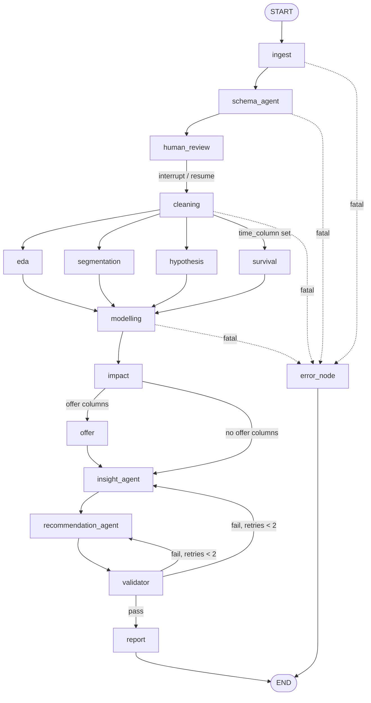

# ChurnLens progress

Project root: /Users/divyanshusrivastava/ChurnLens

## Current task
T1.2

## Next step
T1.2: scaffold backend and frontend skeleton, CI, .env.example files.

## Done
- Bootstrap: plan, spec, rules, settings, data generators and backend/.env unpacked.
- Preflight: tools checked, Gemini models selected, gh logged in, secret check in place.
- Sample data generated: telco_churn.csv (7,014 rows = 7,000 unique + 14 duplicates,
  11 blank TotalCharges) and the 4-table India dataset (git-ignored, regenerate
  with scripts/generate_india_sample.py).
- T1.1: architecture restated, Mermaid flow, top 5 risks (docs only, no tests).

## Decisions
- Mode: FULL-AUTO (see CLAUDE.md AUTOPILOT).
- Project root is ~/ChurnLens (not ~/Documents/ChurnLens), linked to the
  public repo github.com/divu8756/ChurnLens. T1.3 reuses this repo instead of
  creating "churnlens".
- Python 3.14.5 (human's choice, replaces 3.11). backend/.venv is built from
  /usr/local/bin/python3.14. All backend dependencies resolve to prebuilt
  wheels on 3.14 (checked with a pip dry run). Dockerfile uses python:3.14-slim.
- Tool versions: Python 3.14.5, Node v24.16.0, git 2.50.1, gh 2.101.0.
  Homebrew is not installed; nothing needed installing.
- Gemini models (scripts/select_gemini_models.py, newest stable, non-preview):
  GEMINI_MODEL=gemini-2.5-pro, GEMINI_MODEL_FAST=gemini-3.8-flash.
- Sample data is synthetic and IBM-Telco-style (fixed seed 20260331); India
  4-table demo dataset (fixed seed 20260401).

### T1.1 Architecture restated
1. A user uploads a CSV/XLSX (100 to 100,000 rows, <= 10 MB) or loads the Telco sample;
   it is stored as parquet under DATA_DIR/{session_id} and deleted after 2 hours.
2. A LangGraph StateGraph runs the analysis; state holds small JSON results and
   file paths, never dataframes. Checkpoints go to SQLite (Postgres if DATABASE_URL).
3. schema_agent (Gemini fast tier) sees only column metadata and 5 sample values,
   and proposes types, id/time/target columns and the positive label.
4. human_review interrupts the graph; the user confirms or edits the schema in the UI
   and the graph resumes with Command(resume=...).
5. Pure-Python stats run after cleaning: EDA, segmentation, survival (only with a
   time column) and hypothesis tests fan out in parallel, then modelling (LR + HGB,
   SHAP, odds ratios, calibrated risk scores) and impact estimates.
6. Gemini (pro tier) only writes insights and recommendations from a compact
   digest; every figure cites a source_key into state.
7. validator_node checks every figure and every number in the text against state,
   sending failures back to the agent (max 2 retries), then drops bad items.
8. Later phases add next best offer, A/B experiments (SQLAlchemy DB), a metrics
   layer with telemetry, a chat agent with whitelisted tools, and PDF/Excel exports.
9. FastAPI exposes upload, SSE progress, schema confirmation, results, metrics,
   chat and export endpoints; CORS is limited to FRONTEND_ORIGIN.
10. The Next.js dashboard (Recharts, Plotly for metrics tabs, KaTeX) only displays
    numbers from the API; backend on Render (Docker), frontend on Vercel.

### T1.1 LangGraph flow

### T1.1 Top 5 risks and mitigations
1. Gemini free-tier rate limits (429) and slow calls stall the pipeline.
   Mitigation: shared token-bucket throttle, backoff honouring retry delay,
   deterministic fallbacks so the dashboard renders without LLM output.
2. The LLM invents or misquotes numbers. Mitigation: digest-only inputs,
   figures[] with source_keys, a strict validator with text number scanning,
   retry loop capped at 2, drop failing items.
3. Statistical errors (wrong test choice, Yates correction, BH, leakage).
   Mitigation: pure stats functions unit-tested against scipy/statsmodels at
   1e-9, leakage guard (ROC-AUC > 0.99), campaign columns excluded as treatments.
4. Python 3.14 is newer than the plan assumed; some libraries (shap/numba,
   lifelines) may have edge-case bugs. Mitigation: pinned versions that
   resolve to wheels, full test suite in CI on 3.14, fall back to
   shap.Explainer if TreeExplainer fails.
5. Graph state and parallel fan-out bugs (concurrent writes, resume re-running
   side effects, large state). Mitigation: one key per producer, reducers on
   shared lists, human_review does nothing before interrupt(), files for
   large data, tests for fan-out merge and resume.

## Checkpoints for the human
- S1 (T1.1): architecture summary, graph flow and risks are under Decisions above.
- Preflight: the only stable Pro model is gemini-2.5-pro (Gemini 3.x Pro exists
  only as preview), while the stable Flash is gemini-3.8-flash, a newer
  generation. The rule says "newest stable Pro", so the older Pro is used for
  GEMINI_MODEL. If you prefer, set GEMINI_MODEL=gemini-3.8-flash in backend/.env.

## Known issues

## Human actions needed
- S7 at the end: Render + Vercel dashboard steps (paste GEMINI_API_KEY into Render yourself).
