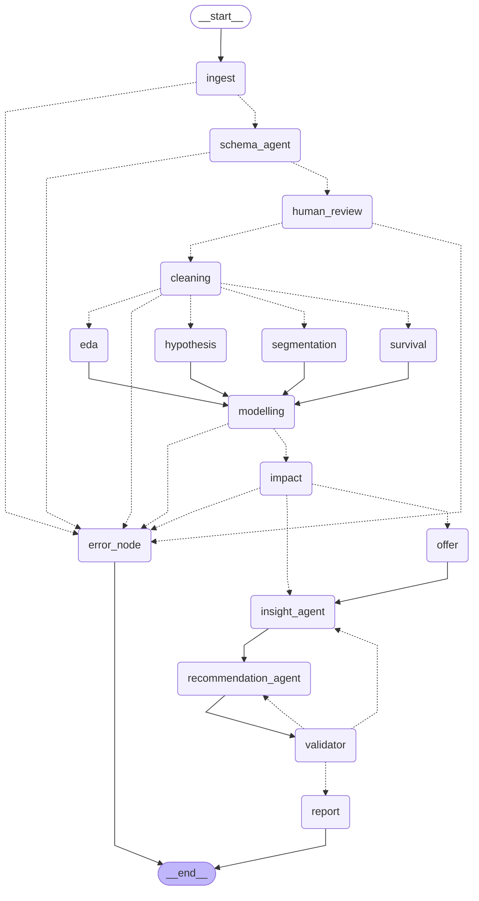

# ChurnLens analysis graph

Generated by `scripts/export_graph.py` from `backend/app/graph/builder.py`.
Dotted edges are conditional.

```mermaid
---
config:
  flowchart:
    curve: linear
---
graph TD;
	__start__([<p>__start__</p>]):::first
	ingest(ingest)
	schema_agent(schema_agent)
	human_review(human_review)
	cleaning(cleaning)
	eda(eda)
	segmentation(segmentation)
	survival(survival)
	hypothesis(hypothesis)
	modelling(modelling)
	impact(impact)
	offer(offer)
	insight_agent(insight_agent)
	recommendation_agent(recommendation_agent)
	validator(validator)
	report(report)
	error_node(error_node)
	__end__([<p>__end__</p>]):::last
	__start__ --> ingest;
	cleaning -.-> eda;
	cleaning -.-> error_node;
	cleaning -.-> hypothesis;
	cleaning -.-> segmentation;
	cleaning -.-> survival;
	eda --> modelling;
	human_review -.-> cleaning;
	human_review -.-> error_node;
	hypothesis --> modelling;
	impact -.-> error_node;
	impact -.-> insight_agent;
	impact -.-> offer;
	ingest -.-> error_node;
	ingest -.-> schema_agent;
	insight_agent --> recommendation_agent;
	modelling -.-> error_node;
	modelling -.-> impact;
	offer --> insight_agent;
	recommendation_agent --> validator;
	schema_agent -.-> error_node;
	schema_agent -.-> human_review;
	segmentation --> modelling;
	survival --> modelling;
	validator -.-> insight_agent;
	validator -.-> recommendation_agent;
	validator -.-> report;
	error_node --> __end__;
	report --> __end__;
	classDef default fill:#f2f0ff,line-height:1.2
	classDef first fill-opacity:0
	classDef last fill:#bfb6fc
```
